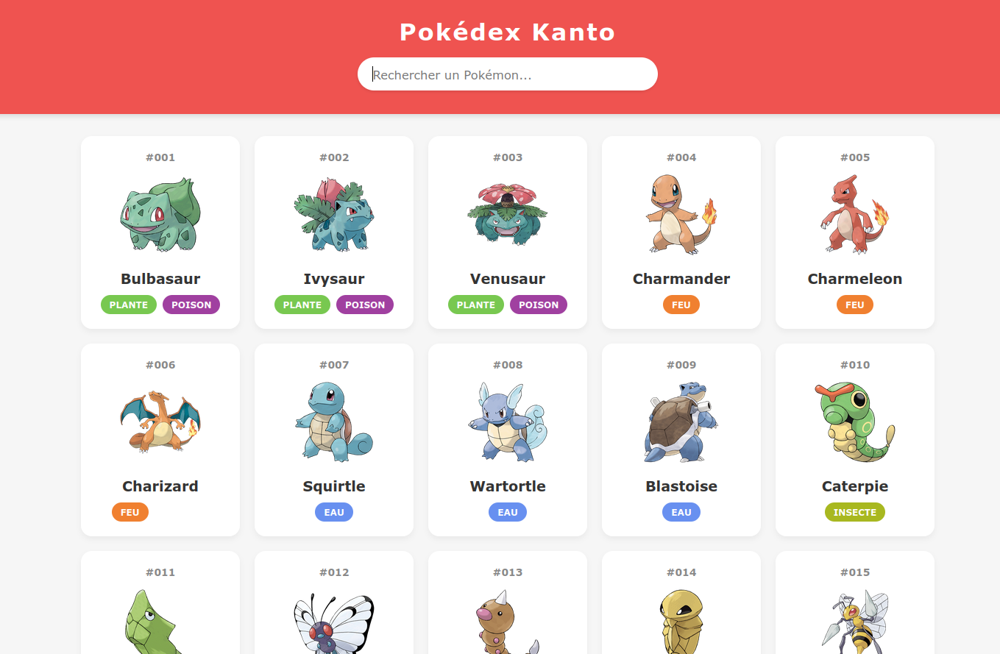

## Fonctionnalités

- Affichage des Pokémon sous forme de cartes
- Recherche par nom ou numéro
- Affichage des types avec couleurs personnalisées
- Design responsive
- Données de l'API Pokémon ou fichier local

## Aperçu du Pokédex

## Installation

1. Clonez ce dépôt
2. Ouvrez `index.html` dans votre navigateur
3. Ou utilisez un serveur local (Live Server, etc.)

## Technologies utilisées

- HTML5
- CSS3
- JavaScript (ES6+)
- PokéAPI (API REST)

## API utilisée

- [PokéAPI](https://pokeapi.co/) - API publique pour les données Pokémon

## Améliorations possibles

- Ajouter plus de détails sur chaque Pokémon
- Filtrer par type
- Ajouter des animations
- Mode sombre/clair
- Pagination

